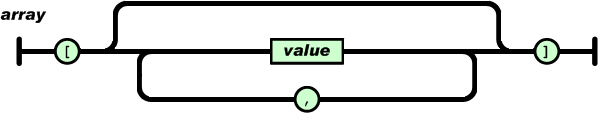
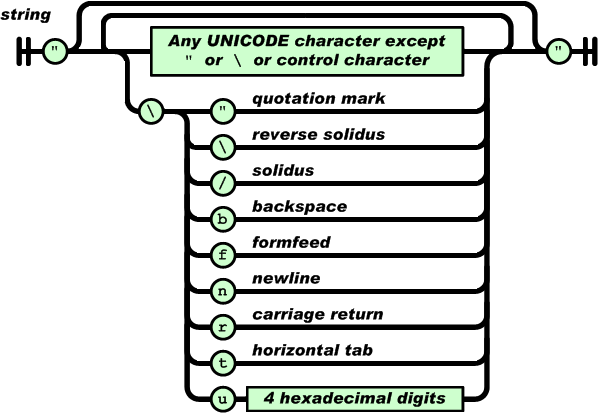

# 设备树 (JSON)

本文档详细介绍 XSTAR 的设备树系统，包括 JSON 语法、设备节点结构、设备树 API 使用等内容。

## 目录

- [引言](#引言)
- [JSON 语法](#json-语法)
- [设备节点结构](#设备节点结构)
- [获取设备节点信息](#获取设备节点信息)
- [访问设备节点属性](#访问设备节点属性)
- [设备树配置示例](#设备树配置示例)
- [设备树文件加载](#设备树文件加载)
- [API 参考](#api-参考)

## 引言

### 设备树的作用

驱动与设备的关系，可以类比为函数与变量的关系。函数负责具体的执行动作，变量负责描述自身属性，两者之间互相依存，缺一不可。

通常情况下，驱动与设备是一对一的关系，即一个驱动对应一个设备。但更多时候是一对多的关系，即一个驱动对应多个设备。例如，一颗主控芯片集成了四个串口，不可能写四份驱动来分别注册设备，通常只写一份驱动，然后分别执行四次注册。

使用变量直接描述设备属性灵活性不够，每次添加设备都需要重新编译，代码可读性也较差。设备树应运而生，只需将所有设备用文本的方式描述好，然后解析文件，依据内容自动生成相应的设备。

### JSON 格式的选择

设备树本质上是一个配置文件，描述了所有设备的属性。JSON 作为一种轻量级的数据交换格式，具有以下优点：

- 简洁的层次结构
- 易于编写和阅读
- 易于机器生成和解析

选择 JSON 作为设备树的存储格式再合适不过了。

## JSON 语法

### 两种基本结构

JSON 有两种基本结构：

1. **"名称/值"对的集合**：在不同语言中被理解为对象（object）、纪录（record）、结构（struct）、字典（dictionary）、哈希表（hash table）、有键列表（keyed list）或关联数组（associative array）
2. **值的有序列表**：在大部分语言中被理解为数组（array）

这些都是常见的数据结构，大部分现代计算机语言都以某种形式支持它们，使得一种数据格式在同样基于这些结构的编程语言之间交换成为可能。

### 五种数据形式

#### 1. 对象（Object）

对象是一个无序的"名称/值"对集合。一个对象以 `{`（左括号）开始，`}`（右括号）结束。每个"名称"后跟一个 `:`（冒号）；"名称/值"对之间使用 `,`（逗号）分隔。

```json
{
  "name": "value",
  "age": 25,
  "active": true
}
```


#### 2. 数组（Array）

数组是值的有序集合。一个数组以 `[`（左中括号）开始，`]`（右中括号）结束。值之间使用 `,`（逗号）分隔。

```json
[1, 2, 3, 4, 5]
```



#### 3. 值（Value）

值可以是：
- 双引号括起来的字符串（string）
- 数值（number）
- 布尔值（true/false）
- 空值（null）
- 对象（object）
- 数组（array）

这些结构可以嵌套。

```json
{
  "string": "Hello, World!",
  "number": 42,
  "boolean": true,
  "null": null,
  "object": {
    "key": "value"
  },
  "array": [1, 2, 3]
}
```


#### 4. 字符串（String）

字符串是由双引号包围的任意数量 Unicode 字符的集合，使用反斜线转义。一个字符（character）即一个单独的字符串（character string）。

字符串与 C 或者 Java 的字符串非常相似。

```json
"Hello, World!"
"这是一个中文字符串"
```



#### 5. 数值（Number）

数值与 C 或者 Java 的数值非常相似，但未曾使用八进制与十六进制格式。

```json
42
3.14
-100
1e10
```


## 设备节点结构

### dtnode 结构体定义

XSTAR 规定设备树中描述的每一个设备节点都是一个 JSON 对象，对象里面可以包含各种形式的键值对。每个设备节点包含如下关键信息：

- 设备节点名称
- 设备自动分配起始索引或设备物理地址
- 具体的 JSON 对象

```c
struct dtnode_t {
    const char * name;
    int id;
    uint64_t addr;
    struct json_value_t * value;
};
```

### 字段说明

- **name**：设备节点名称，对应驱动名称
- **id**：设备自动分配的起始索引 ID
- **addr**：设备物理地址
- **value**：包含设备属性的 JSON 对象

## 获取设备节点信息

### 设备节点命名格式

设备节点的命名格式为：`"driver-name:id"` 或 `"driver-name:0xaddress"`

- **driver-name**：驱动名称，自动匹配同名驱动
- **id**：设备分配的起始索引 ID（数值）
- **0xaddress**：设备物理地址（十六进制格式）

### 示例节点

```json
{
  "led-gpio:0": {
    "gpio": 0,
    "active-low": true,
    "default-brightness": 0
  },

  "uart-pl011:0x10009000": {
    "clock-name": "uclk",
    "txd-gpio": -1,
    "txd-gpio-config": -1,
    "rxd-gpio": -1,
    "rxd-gpio-config": -1,
    "baud-rates": 115200,
    "data-bits": 8,
    "parity-bits": 0,
    "stop-bits": 1
  }
}
```

### 获取设备节点名称

获取 `:` 左侧部分，这个节点名称就是对应的驱动名称。在依据设备树添加设备时，会自动匹配同名驱动。

**函数原型：**
```c
const char * dt_read_name(struct dtnode_t * n);
```

**使用示例：**
```c
const char * name = dt_read_name(n);
```

**设备匹配顺序：**
写在设备树前面的设备节点先匹配，写在后面的设备节点后匹配。这提供了优先级机制，解决设备间互相依赖的问题。

如果一个设备依赖于另一个设备，该设备的节点必须写在依赖设备的后面。如果顺序颠倒，在注册设备时会因找不到依赖设备而出现注册失败。

**设备节点排列建议：**
- 最前面：底层驱动设备（如 `clk`、`irq`、`gpio`）
- 后面：高等级设备（如 `framebuffer`、`uart`）

### 获取设备自动分配起始索引

获取 `:` 右侧部分（数值类型）。起始索引 ID 主要用于同一个驱动注册多个设备时，可以手动指定设备尾缀，以 `.0`、`.1`、`.2` 等形式存在。

**函数原型：**
```c
int dt_read_id(struct dtnode_t * n);
```

**使用示例：**
```c
int id = dt_read_id(n);
```

**设备尾缀分配规则：**
- 如果设备节点提供了 ID，则使用指定的尾缀
- 如果该尾缀已被占用，则自动加一，直到找到空闲尾缀
- 如果设备节点没有提供 ID，则从 `.0` 开始

### 获取设备物理地址

这个函数与获取自动分配起始索引几乎一模一样，唯一的差异是返回值的类型。

**函数原型：**
```c
uint64_t dt_read_address(struct dtnode_t * n);
```

**使用示例：**
```c
uint64_t addr = dt_read_address(n);
```

**设备节点形态：**
- 带设备物理地址的节点（如 `uart-pl011:0x10009000`）
- 不带设备物理地址的节点（如 `led-gpio:0`）

两种形态在描述设备时不加以区分，仅在注册设备时，驱动才显式调用对应的方法获取设备信息。

## 访问设备节点属性

设备节点对象包含各种形式的键值对，包括布尔逻辑、整型、浮点、字符串、对象、数组。

每个具体的实现函数都提供了默认值参数，如果找不到该键值对，就返回传递的默认值。

### 读取布尔值

**函数原型：**
```c
int dt_read_bool(struct dtnode_t * n, const char * name, int def);
```

**参数说明：**
- `n`：设备节点
- `name`：属性名称
- `def`：默认值

**返回值：**
- 如果属性存在且为布尔类型，返回其值（0 或 1）
- 否则返回默认值

**使用示例：**
```c
int active_low = dt_read_bool(n, "active-low", FALSE);
if(active_low) {
    /* 激活低电平 */
}
```

**配置示例：**
```json
{
  "led-gpio:0": {
    "active-low": true
  }
}
```

### 读取整型数据

**函数原型：**
```c
int dt_read_int(struct dtnode_t * n, const char * name, int def);
```

**参数说明：**
- `n`：设备节点
- `name`：属性名称
- `def`：默认值

**返回值：**
- 如果属性存在且为整型，返回其值
- 否则返回默认值

**使用示例：**
```c
int gpio = dt_read_int(n, "gpio", -1);
if(gpio >= 0) {
    /* 使用 GPIO */
}
```

**配置示例：**
```json
{
  "uart-pl011:0x10009000": {
    "baud-rates": 115200,
    "data-bits": 8,
    "parity-bits": 0,
    "stop-bits": 1
  }
}
```

### 读取长整型数据

**函数原型：**
```c
long long dt_read_long(struct dtnode_t * n, const char * name, long long def);
```

**参数说明：**
- `n`：设备节点
- `name`：属性名称
- `def`：默认值

**返回值：**
- 如果属性存在且为长整型，返回其值
- 否则返回默认值

**使用示例：**
```c
long long freq = dt_read_long(n, "clock-frequency", 24000000LL);
```

**配置示例：**
```json
{
  "clk-fixed:0": {
    "clock-frequency": 24000000
  }
}
```

### 读取无符号定宽整型

提供 8/16/32/64 位的无符号定宽整型读取函数：

```c
uint8_t  dt_read_u8(struct dtnode_t * n, const char * name, uint8_t def);
uint16_t dt_read_u16(struct dtnode_t * n, const char * name, uint16_t def);
uint32_t dt_read_u32(struct dtnode_t * n, const char * name, uint32_t def);
uint64_t dt_read_u64(struct dtnode_t * n, const char * name, uint64_t def);
```

### 读取浮点型数据

**函数原型：**
```c
double dt_read_double(struct dtnode_t * n, const char * name, double def);
```

**参数说明：**
- `n`：设备节点
- `name`：属性名称
- `def`：默认值

**返回值：**
- 如果属性存在且为浮点型，返回其值
- 否则返回默认值

**使用示例：**
```c
double voltage = dt_read_double(n, "reference-voltage", 3.3);
```

**配置示例：**
```json
{
  "adc-linux:0": {
    "reference-voltage": 3.3,
    "resolution": 12
  }
}
```

### 读取字符串

**函数原型：**
```c
char * dt_read_string(struct dtnode_t * n, const char * name, char * def);
```

**参数说明：**
- `n`：设备节点
- `name`：属性名称
- `def`：默认值

**返回值：**
- 如果属性存在且为字符串类型，返回其值
- 否则返回默认值

**使用示例：**
```c
const char * device = dt_read_string(n, "device", NULL);
if(device) {
    /* 使用设备路径 */
}
```

**配置示例：**
```json
{
  "gpio-v1-linux:0": {
    "device": "/dev/gpiochip0",
    "gpio-base": 0
  }
}
```

### 读取 JSON 对象

**函数原型：**
```c
struct dtnode_t * dt_read_object(struct dtnode_t * n, const char * name, struct dtnode_t * o);
```

**参数说明：**
- `n`：设备节点
- `name`：属性名称
- `o`：用于存储结果的设备节点

**返回值：**
- 如果属性存在且为对象类型，返回设备节点指针
- 否则返回 NULL

**使用示例：**
```c
struct dtnode_t subnode;
if(dt_read_object(n, "sub-node", &subnode)) {
    int value = dt_read_int(&subnode, "value", 0);
}
```

**配置示例：**
```json
{
  "my-device:0": {
    "sub-node": {
      "value": 42
    }
  }
}
```

### 读取数组长度

**函数原型：**
```c
int dt_read_array_length(struct dtnode_t * n, const char * name);
```

**参数说明：**
- `n`：设备节点
- `name`：数组属性名称

**返回值：**
- 如果属性存在且为数组类型，返回数组长度
- 否则返回 0

**使用示例：**
```c
int len = dt_read_array_length(n, "gpio-list");
for(int i = 0; i < len; i++) {
    int gpio = dt_read_array_int(n, "gpio-list", i, -1);
    /* 处理每个 GPIO */
}
```

**配置示例：**
```json
{
  "led-gpio:0": {
    "gpio-list": [10, 11, 12, 13]
  }
}
```

### 读取数组中的布尔值

**函数原型：**
```c
int dt_read_array_bool(struct dtnode_t * n, const char * name, int idx, int def);
```

**参数说明：**
- `n`：设备节点
- `name`：数组属性名称
- `idx`：数组索引
- `def`：默认值

**返回值：**
- 如果数组索引有效且为布尔类型，返回其值
- 否则返回默认值

### 读取数组中的整型数据

**函数原型：**
```c
int dt_read_array_int(struct dtnode_t * n, const char * name, int idx, int def);
```

**参数说明：**
- `n`：设备节点
- `name`：数组属性名称
- `idx`：数组索引
- `def`：默认值

**返回值：**
- 如果数组索引有效且为整型，返回其值
- 否则返回默认值

**使用示例：**
```c
int gpio = dt_read_array_int(n, "gpio-list", 0, -1);
```

### 读取数组中的长整型数据

**函数原型：**
```c
long long dt_read_array_long(struct dtnode_t * n, const char * name, int idx, long long def);
```

**参数说明：**
- `n`：设备节点
- `name`：数组属性名称
- `idx`：数组索引
- `def`：默认值

**返回值：**
- 如果数组索引有效且为长整型，返回其值
- 否则返回默认值

### 读取数组中的无符号定宽整型

```c
uint8_t  dt_read_array_u8(struct dtnode_t * n, const char * name, int idx, uint8_t def);
uint16_t dt_read_array_u16(struct dtnode_t * n, const char * name, int idx, uint16_t def);
uint32_t dt_read_array_u32(struct dtnode_t * n, const char * name, int idx, uint32_t def);
uint64_t dt_read_array_u64(struct dtnode_t * n, const char * name, int idx, uint64_t def);
```

### 读取数组中的浮点型数据

**函数原型：**
```c
double dt_read_array_double(struct dtnode_t * n, const char * name, int idx, double def);
```

**参数说明：**
- `n`：设备节点
- `name`：数组属性名称
- `idx`：数组索引
- `def`：默认值

**返回值：**
- 如果数组索引有效且为浮点型，返回其值
- 否则返回默认值

### 读取数组中的字符串

**函数原型：**
```c
char * dt_read_array_string(struct dtnode_t * n, const char * name, int idx, char * def);
```

**参数说明：**
- `n`：设备节点
- `name`：数组属性名称
- `idx`：数组索引
- `def`：默认值

**返回值：**
- 如果数组索引有效且为字符串类型，返回其值
- 否则返回默认值

**配置示例：**
```json
{
  "my-device:0": {
    "name-list": ["device1", "device2", "device3"]
  }
}
```

### 读取数组中的 JSON 对象

**函数原型：**
```c
struct dtnode_t * dt_read_array_object(struct dtnode_t * n, const char * name, int idx, struct dtnode_t * o);
```

**参数说明：**
- `n`：设备节点
- `name`：数组属性名称
- `idx`：数组索引
- `o`：用于存储结果的设备节点

**返回值：**
- 如果数组索引有效且为对象类型，返回设备节点指针
- 否则返回 NULL

**配置示例：**
```json
{
  "my-device:0": {
    "device-list": [
      {
        "name": "device1",
        "value": 10
      },
      {
        "name": "device2",
        "value": 20
      }
    ]
  }
}
```

## 设备树配置示例

### GPIO 设备配置

```json
{
  "gpio-v1-linux:0": {
    "device": "/dev/gpiochip0",
    "gpio-base": 0
  }
}
```

### LED 设备配置

```json
{
  "led-gpio:0": {
    "gpio": "gpio-v1-linux:10",
    "active-low": true,
    "default-brightness": 0
  }
}
```

### UART 设备配置

```json
{
  "uart-pl011:0x10009000": {
    "clock-name": "uclk",
    "txd-gpio": -1,
    "txd-gpio-config": -1,
    "rxd-gpio": -1,
    "rxd-gpio-config": -1,
    "baud-rates": 115200,
    "data-bits": 8,
    "parity-bits": 0,
    "stop-bits": 1
  }
}
```

### I2C 设备配置

```json
{
  "i2c-gpio:0": {
    "sda-gpio": "gpio-v1-linux:2",
    "scl-gpio": "gpio-v1-linux:3",
    "delay-us": 5
  }
}
```

### LCD 面板配置

```json
{
  "lcd-panel:0": {
    "width": 800,
    "height": 480,
    "bus-width": 16,
    "reset-gpio": "gpio-v1-linux:4",
    "enable-gpio": "gpio-v1-linux:5"
  }
}
```

### 时钟设备配置

```json
{
  "clk-fixed:0": {
    "clock-frequency": 24000000
  }
}
```

### ADC 设备配置

```json
{
  "adc-linux:0": {
    "path": "/sys/bus/iio/devices/iio:device0/in_voltage0_raw",
    "reference-voltage": 4096000,
    "resolution": 12
  }
}
```

### 复杂设备树示例

```json
{
  "clk-fixed:0": {
    "clock-frequency": 24000000
  },
  "gpio-v1-linux:0": {
    "device": "/dev/gpiochip0",
    "gpio-base": 0
  },
  "i2c-gpio:0": {
    "sda-gpio": "gpio-v1-linux:2",
    "scl-gpio": "gpio-v1-linux:3",
    "delay-us": 5
  },
  "led-gpio:0": {
    "gpio": "gpio-v1-linux:10",
    "active-low": true,
    "default-brightness": 0
  },
  "lcd-panel:0": {
    "width": 800,
    "height": 480,
    "bus-width": 16,
    "reset-gpio": "gpio-v1-linux:4",
    "enable-gpio": "gpio-v1-linux:5"
  }
}
```

## 设备引用

### 引用其他设备

设备属性可以引用其他设备，通过 `"driver-name:id"` 格式指定。

**示例：**
```json
{
    "i2c-t113:0": {
        "base-address": 0x40005000,
        "clock-name": "pclk",
        "sda-gpio": 84,
        "sda-gpio-config": 1,
        "scl-gpio": 85,
        "scl-gpio-config": 1
    },
    "ts-gt911": {
        "i2c-bus": "i2c-t113:0",
        "slave-address": 20,
        "interrupt-gpio": 35,
        "interrupt-gpio-config": 14,
        "reset-gpio": 34,
        "reset-gpio-config": 1
    }
}
```

**代码中解析引用：**
```c
static struct device_t * my_device_probe(struct driver_t * drv, struct dtnode_t * n)
{
    const char *bus_name = dt_read_string(n, "i2c-bus", NULL);
    struct i2c_t *i2c = search_i2c(bus_name);

    if(!i2c)
        return NULL;

    /* 使用 i2c */
    return register_my_device(drv, pdat);
}
```

### 引用规则

- 被引用的设备必须在引用设备之前定义
- 引用格式为 `"driver-name:id"` 或 `"driver-name:0xaddress"`
- 系统在解析设备树时会自动解析引用关系

### 禁用设备

可以通过 `"status": "disabled"` 来禁用某个设备。

**示例：**
```json
{
  "my-device:0": {
    "status": "disabled"
  }
}
```

## API 参考

### 获取设备节点信息

```c
const char * dt_read_name(struct dtnode_t * n);
int dt_read_id(struct dtnode_t * n);
uint64_t dt_read_address(struct dtnode_t * n);
```

### 读取简单属性

```c
int dt_read_bool(struct dtnode_t * n, const char * name, int def);
int dt_read_int(struct dtnode_t * n, const char * name, int def);
long long dt_read_long(struct dtnode_t * n, const char * name, long long def);
uint8_t dt_read_u8(struct dtnode_t * n, const char * name, uint8_t def);
uint16_t dt_read_u16(struct dtnode_t * n, const char * name, uint16_t def);
uint32_t dt_read_u32(struct dtnode_t * n, const char * name, uint32_t def);
uint64_t dt_read_u64(struct dtnode_t * n, const char * name, uint64_t def);
double dt_read_double(struct dtnode_t * n, const char * name, double def);
char * dt_read_string(struct dtnode_t * n, const char * name, char * def);
```

### 读取对象属性

```c
struct dtnode_t * dt_read_object(struct dtnode_t * n, const char * name, struct dtnode_t * o);
```

### 读取数组属性

```c
int dt_read_array_length(struct dtnode_t * n, const char * name);
int dt_read_array_bool(struct dtnode_t * n, const char * name, int idx, int def);
int dt_read_array_int(struct dtnode_t * n, const char * name, int idx, int def);
long long dt_read_array_long(struct dtnode_t * n, const char * name, int idx, long long def);
uint8_t dt_read_array_u8(struct dtnode_t * n, const char * name, int idx, uint8_t def);
uint16_t dt_read_array_u16(struct dtnode_t * n, const char * name, int idx, uint16_t def);
uint32_t dt_read_array_u32(struct dtnode_t * n, const char * name, int idx, uint32_t def);
uint64_t dt_read_array_u64(struct dtnode_t * n, const char * name, int idx, uint64_t def);
double dt_read_array_double(struct dtnode_t * n, const char * name, int idx, double def);
char * dt_read_array_string(struct dtnode_t * n, const char * name, int idx, char * def);
struct dtnode_t * dt_read_array_object(struct dtnode_t * n, const char * name, int idx, struct dtnode_t * o);
```

## 最佳实践

### 1. 设备树组织

- 将底层设备放在前面（如 `clk`、`irq`、`gpio`）
- 将高层设备放在后面（如 `framebuffer`、`uart`）
- 保持依赖关系正确：被依赖的设备必须先定义

### 2. 属性命名

- 使用小写字母和连字符（kebab-case）
- 名称要具有描述性
- 保持命名一致性

### 3. 默认值

- 为所有可选属性提供合理的默认值
- 使用 `-1` 作为无效的 GPIO 引脚号
- 使用 `0` 作为禁用或关闭的标志

### 4. 错误处理

- 始终检查返回值
- 提供有意义的默认值
- 在日志中记录解析错误

### 5. 文档说明

- 为每个设备类型编写配置示例
- 说明每个属性的作用和取值范围
- 提供完整的设备树示例

## 设备树文件加载

### 加载机制

设备树文件通过 `xstar_init` 函数的 `json` 参数指定。函数原型如下：

```c
void xstar_init(struct xos_environ_t * env, const char * json);
```

**参数说明：**
- `env`：系统环境参数
- `json`：设备树文件路径

**默认路径：**
如果 `json` 参数为 `NULL`，系统将自动使用默认路径 `/romdisk/boot/boot.json`。

**使用示例：**

```c
xstar_init(&env, "/romdisk/boot/custom.json");
```

或使用默认设备树：

```c
xstar_init(&env, NULL);
```

### 加载流程

系统启动时的设备树加载流程如下：

1. `xstar_init` 被调用，接收 `json` 参数
2. 调用 `do_init_dtree(json)` 初始化设备树
3. `do_init_dtree` 检查 `json` 参数：
   - 如果不为 `NULL`，使用指定的文件路径
   - 如果为 `NULL`，使用默认路径 `/romdisk/boot/boot.json`
4. 从文件系统读取设备树 JSON 文件内容
5. 解析 JSON 并调用 `probe_device` 注册所有设备

## 总结

设备树是 XSTAR 系统的核心配置机制，通过 JSON 格式描述所有设备的属性和配置。设备树文件可以通过 `xstar_init` 函数的参数指定，或使用默认的 `/romdisk/boot/boot.json`。

设备树操作 API 使用请参考各种驱动实现。
