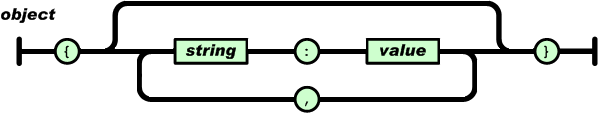
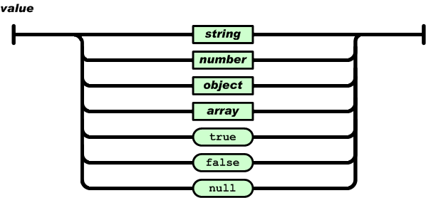
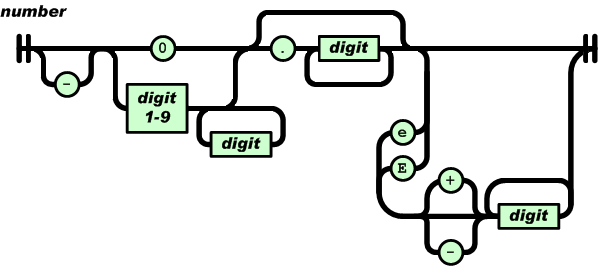

# Device Tree (JSON)

This document introduces the XSTAR device tree system in detail, including JSON syntax, device node structure, and usage of the device tree API.

## Table of Contents

- [Introduction](#introduction)
- [JSON Syntax](#json-syntax)
- [Device Node Structure](#device-node-structure)
- [Getting Device Node Info](#getting-device-node-info)
- [Accessing Device Node Properties](#accessing-device-node-properties)
- [Device Tree Configuration Examples](#device-tree-configuration-examples)
- [Device Tree File Loading](#device-tree-file-loading)
- [API Reference](#api-reference)

## Introduction

### The Role of the Device Tree

The relationship between a driver and a device can be likened to the relationship between a function and a variable. The function is responsible for the specific actions to execute, while the variable describes its own attributes. The two are interdependent and indispensable.

Typically, a driver and a device have a one-to-one relationship, meaning one driver corresponds to one device. But more often it is a one-to-many relationship, where one driver corresponds to multiple devices. For example, if a main control chip integrates four serial ports, you would not write four separate drivers to register the devices; instead, you write a single driver and then perform registration four times.

Using variables to directly describe device attributes is not flexible enough — every time a device is added, a recompilation is required, and code readability is poor. The device tree was created to address this: simply describe all devices in text form, then parse the file and automatically generate the corresponding devices based on its content.

### Choosing the JSON Format

The device tree is essentially a configuration file that describes the attributes of all devices. As a lightweight data interchange format, JSON offers the following advantages:

- Concise hierarchical structure
- Easy to write and read
- Easy for machines to generate and parse

JSON is a natural choice as the storage format for the device tree.

## JSON Syntax

### Two Basic Structures

JSON has two basic structures:

1. **A collection of name/value pairs**: Understood in different languages as an object, record, struct, dictionary, hash table, keyed list, or associative array.
2. **An ordered list of values**: Understood in most languages as an array.

These are common data structures. Most modern programming languages support them in some form, making it possible to exchange a data format between languages that are likewise based on these structures.

### Five Data Forms

#### 1. Object

An object is an unordered collection of name/value pairs. An object begins with `{` (left brace) and ends with `}` (right brace). Each name is followed by `:` (colon); name/value pairs are separated by `,` (comma).

```json
{
  "name": "value",
  "age": 25,
  "active": true
}
```



#### 2. Array

An array is an ordered collection of values. An array begins with `[` (left bracket) and ends with `]` (right bracket). Values are separated by `,` (comma).

```json
[1, 2, 3, 4, 5]
```


#### 3. Value

A value can be:
- A string in double quotes (string)
- A number
- A boolean (true/false)
- A null value (null)
- An object
- An array

These structures can be nested.

```json
{
  "string": "Hello, World!",
  "number": 42,
  "boolean": true,
  "null": null,
  "object": {
    "key": "value"
  },
  "array": [1, 2, 3]
}
```



#### 4. String

A string is a collection of any number of Unicode characters enclosed in double quotes, escaped with backslashes. A character is a single character string.

Strings are very similar to strings in C or Java.

```json
"Hello, World!"
"This is an English string"
```


#### 5. Number

Numbers are very similar to numbers in C or Java, but octal and hexadecimal formats are not used.

```json
42
3.14
-100
1e10
```



## Device Node Structure

### dtnode Structure Definition

XSTAR requires that every device node described in the device tree is a JSON object, which can contain various forms of key-value pairs. Each device node contains the following key information:

- Device node name
- Device auto-allocation starting index or device physical address
- The concrete JSON object

```c
struct dtnode_t {
    const char * name;
    int id;
    uint64_t addr;
    struct json_value_t * value;
};
```

### Field Description

- **name**: Device node name, corresponding to the driver name
- **id**: Device auto-assigned starting index ID
- **addr**: Device physical address
- **value**: The JSON object containing the device properties

## Getting Device Node Info

### Device Node Naming Format

The device node naming format is: `"driver-name:id"` or `"driver-name:0xaddress"`

- **driver-name**: Driver name, automatically matches a driver with the same name
- **id**: Starting index ID assigned to the device (numeric)
- **0xaddress**: Device physical address (hexadecimal format)

### Example Nodes

```json
{
  "led-gpio:0": {
    "gpio": 0,
    "active-low": true,
    "default-brightness": 0
  },

  "uart-pl011:0x10009000": {
    "clock-name": "uclk",
    "txd-gpio": -1,
    "txd-gpio-config": -1,
    "rxd-gpio": -1,
    "rxd-gpio-config": -1,
    "baud-rates": 115200,
    "data-bits": 8,
    "parity-bits": 0,
    "stop-bits": 1
  }
}
```

### Getting the Device Node Name

Get the part to the left of `:`; this node name is the corresponding driver name. When adding a device based on the device tree, a driver with the same name is automatically matched.

**Function prototype:**
```c
const char * dt_read_name(struct dtnode_t * n);
```

**Usage example:**
```c
const char * name = dt_read_name(n);
```

**Device matching order:**
Device nodes written earlier in the device tree are matched first, and nodes written later are matched later. This provides a priority mechanism to resolve inter-device dependencies.

If a device depends on another device, its node must be written after the dependency device. If the order is reversed, registration will fail because the dependency device cannot be found when registering the device.

**Device node ordering recommendations:**
- At the very front: low-level driver devices (e.g. `clk`, `irq`, `gpio`)
- After: higher-level devices (e.g. `framebuffer`, `uart`)

### Getting the Auto-Allocation Starting Index

Get the part to the right of `:` (numeric type). The starting index ID is mainly used when the same driver registers multiple devices; you can manually specify the device suffix, which exists in the form `.0`, `.1`, `.2`, etc.

**Function prototype:**
```c
int dt_read_id(struct dtnode_t * n);
```

**Usage example:**
```c
int id = dt_read_id(n);
```

**Device suffix allocation rules:**
- If the device node provides an ID, the specified suffix is used.
- If that suffix is already taken, it is incremented by one until a free suffix is found.
- If the device node does not provide an ID, it starts from `.0`.

### Getting the Device Physical Address

This function is almost identical to getting the auto-allocation starting index; the only difference is the return value type.

**Function prototype:**
```c
uint64_t dt_read_address(struct dtnode_t * n);
```

**Usage example:**
```c
uint64_t addr = dt_read_address(n);
```

**Device node forms:**
- Nodes with a device physical address (e.g. `uart-pl011:0x10009000`)
- Nodes without a device physical address (e.g. `led-gpio:0`)

The two forms are not distinguished when describing devices; only when registering a device does the driver explicitly call the corresponding method to get the device information.

## Accessing Device Node Properties

A device node object contains various forms of key-value pairs, including booleans, integers, floating-point numbers, strings, objects, and arrays.

Each concrete implementation function provides a default value parameter. If the key-value pair cannot be found, the passed default value is returned.

### Reading a Boolean

**Function prototype:**
```c
int dt_read_bool(struct dtnode_t * n, const char * name, int def);
```

**Parameters:**
- `n`: Device node
- `name`: Property name
- `def`: Default value

**Return value:**
- If the property exists and is a boolean, returns its value (0 or 1)
- Otherwise returns the default value

**Usage example:**
```c
int active_low = dt_read_bool(n, "active-low", FALSE);
if(active_low) {
    /* Active low */
}
```

**Configuration example:**
```json
{
  "led-gpio:0": {
    "active-low": true
  }
}
```

### Reading an Integer

**Function prototype:**
```c
int dt_read_int(struct dtnode_t * n, const char * name, int def);
```

**Parameters:**
- `n`: Device node
- `name`: Property name
- `def`: Default value

**Return value:**
- If the property exists and is an integer, returns its value
- Otherwise returns the default value

**Usage example:**
```c
int gpio = dt_read_int(n, "gpio", -1);
if(gpio >= 0) {
    /* Use GPIO */
}
```

**Configuration example:**
```json
{
  "uart-pl011:0x10009000": {
    "baud-rates": 115200,
    "data-bits": 8,
    "parity-bits": 0,
    "stop-bits": 1
  }
}
```

### Reading a Long Integer

**Function prototype:**
```c
long long dt_read_long(struct dtnode_t * n, const char * name, long long def);
```

**Parameters:**
- `n`: Device node
- `name`: Property name
- `def`: Default value

**Return value:**
- If the property exists and is a long integer, returns its value
- Otherwise returns the default value

**Usage example:**
```c
long long freq = dt_read_long(n, "clock-frequency", 24000000LL);
```

**Configuration example:**
```json
{
  "clk-fixed:0": {
    "clock-frequency": 24000000
  }
}
```

### Reading Unsigned Fixed-Width Integers

Provides 8/16/32/64-bit unsigned fixed-width integer read functions:

```c
uint8_t  dt_read_u8(struct dtnode_t * n, const char * name, uint8_t def);
uint16_t dt_read_u16(struct dtnode_t * n, const char * name, uint16_t def);
uint32_t dt_read_u32(struct dtnode_t * n, const char * name, uint32_t def);
uint64_t dt_read_u64(struct dtnode_t * n, const char * name, uint64_t def);
```

### Reading a Floating-Point Number

**Function prototype:**
```c
double dt_read_double(struct dtnode_t * n, const char * name, double def);
```

**Parameters:**
- `n`: Device node
- `name`: Property name
- `def`: Default value

**Return value:**
- If the property exists and is a floating-point number, returns its value
- Otherwise returns the default value

**Usage example:**
```c
double voltage = dt_read_double(n, "reference-voltage", 3.3);
```

**Configuration example:**
```json
{
  "adc-linux:0": {
    "reference-voltage": 3.3,
    "resolution": 12
  }
}
```

### Reading a String

**Function prototype:**
```c
char * dt_read_string(struct dtnode_t * n, const char * name, char * def);
```

**Parameters:**
- `n`: Device node
- `name`: Property name
- `def`: Default value

**Return value:**
- If the property exists and is a string, returns its value
- Otherwise returns the default value

**Usage example:**
```c
const char * device = dt_read_string(n, "device", NULL);
if(device) {
    /* Use the device path */
}
```

**Configuration example:**
```json
{
  "gpio-v1-linux:0": {
    "device": "/dev/gpiochip0",
    "gpio-base": 0
  }
}
```

### Reading a JSON Object

**Function prototype:**
```c
struct dtnode_t * dt_read_object(struct dtnode_t * n, const char * name, struct dtnode_t * o);
```

**Parameters:**
- `n`: Device node
- `name`: Property name
- `o`: Device node used to store the result

**Return value:**
- If the property exists and is an object, returns the device node pointer
- Otherwise returns NULL

**Usage example:**
```c
struct dtnode_t subnode;
if(dt_read_object(n, "sub-node", &subnode)) {
    int value = dt_read_int(&subnode, "value", 0);
}
```

**Configuration example:**
```json
{
  "my-device:0": {
    "sub-node": {
      "value": 42
    }
  }
}
```

### Reading the Array Length

**Function prototype:**
```c
int dt_read_array_length(struct dtnode_t * n, const char * name);
```

**Parameters:**
- `n`: Device node
- `name`: Array property name

**Return value:**
- If the property exists and is an array, returns the array length
- Otherwise returns 0

**Usage example:**
```c
int len = dt_read_array_length(n, "gpio-list");
for(int i = 0; i < len; i++) {
    int gpio = dt_read_array_int(n, "gpio-list", i, -1);
    /* Process each GPIO */
}
```

**Configuration example:**
```json
{
  "led-gpio:0": {
    "gpio-list": [10, 11, 12, 13]
  }
}
```

### Reading a Boolean from an Array

**Function prototype:**
```c
int dt_read_array_bool(struct dtnode_t * n, const char * name, int idx, int def);
```

**Parameters:**
- `n`: Device node
- `name`: Array property name
- `idx`: Array index
- `def`: Default value

**Return value:**
- If the array index is valid and is a boolean, returns its value
- Otherwise returns the default value

### Reading an Integer from an Array

**Function prototype:**
```c
int dt_read_array_int(struct dtnode_t * n, const char * name, int idx, int def);
```

**Parameters:**
- `n`: Device node
- `name`: Array property name
- `idx`: Array index
- `def`: Default value

**Return value:**
- If the array index is valid and is an integer, returns its value
- Otherwise returns the default value

**Usage example:**
```c
int gpio = dt_read_array_int(n, "gpio-list", 0, -1);
```

### Reading a Long Integer from an Array

**Function prototype:**
```c
long long dt_read_array_long(struct dtnode_t * n, const char * name, int idx, long long def);
```

**Parameters:**
- `n`: Device node
- `name`: Array property name
- `idx`: Array index
- `def`: Default value

**Return value:**
- If the array index is valid and is a long integer, returns its value
- Otherwise returns the default value

### Reading Unsigned Fixed-Width Integers from an Array

```c
uint8_t  dt_read_array_u8(struct dtnode_t * n, const char * name, int idx, uint8_t def);
uint16_t dt_read_array_u16(struct dtnode_t * n, const char * name, int idx, uint16_t def);
uint32_t dt_read_array_u32(struct dtnode_t * n, const char * name, int idx, uint32_t def);
uint64_t dt_read_array_u64(struct dtnode_t * n, const char * name, int idx, uint64_t def);
```

### Reading a Floating-Point Number from an Array

**Function prototype:**
```c
double dt_read_array_double(struct dtnode_t * n, const char * name, int idx, double def);
```

**Parameters:**
- `n`: Device node
- `name`: Array property name
- `idx`: Array index
- `def`: Default value

**Return value:**
- If the array index is valid and is a floating-point number, returns its value
- Otherwise returns the default value

### Reading a String from an Array

**Function prototype:**
```c
char * dt_read_array_string(struct dtnode_t * n, const char * name, int idx, char * def);
```

**Parameters:**
- `n`: Device node
- `name`: Array property name
- `idx`: Array index
- `def`: Default value

**Return value:**
- If the array index is valid and is a string, returns its value
- Otherwise returns the default value

**Configuration example:**
```json
{
  "my-device:0": {
    "name-list": ["device1", "device2", "device3"]
  }
}
```

### Reading a JSON Object from an Array

**Function prototype:**
```c
struct dtnode_t * dt_read_array_object(struct dtnode_t * n, const char * name, int idx, struct dtnode_t * o);
```

**Parameters:**
- `n`: Device node
- `name`: Array property name
- `idx`: Array index
- `o`: Device node used to store the result

**Return value:**
- If the array index is valid and is an object, returns the device node pointer
- Otherwise returns NULL

**Configuration example:**
```json
{
  "my-device:0": {
    "device-list": [
      {
        "name": "device1",
        "value": 10
      },
      {
        "name": "device2",
        "value": 20
      }
    ]
  }
}
```

## Device Tree Configuration Examples

### GPIO Device Configuration

```json
{
  "gpio-v1-linux:0": {
    "device": "/dev/gpiochip0",
    "gpio-base": 0
  }
}
```

### LED Device Configuration

```json
{
  "led-gpio:0": {
    "gpio": "gpio-v1-linux:10",
    "active-low": true,
    "default-brightness": 0
  }
}
```

### UART Device Configuration

```json
{
  "uart-pl011:0x10009000": {
    "clock-name": "uclk",
    "txd-gpio": -1,
    "txd-gpio-config": -1,
    "rxd-gpio": -1,
    "rxd-gpio-config": -1,
    "baud-rates": 115200,
    "data-bits": 8,
    "parity-bits": 0,
    "stop-bits": 1
  }
}
```

### I2C Device Configuration

```json
{
  "i2c-gpio:0": {
    "sda-gpio": "gpio-v1-linux:2",
    "scl-gpio": "gpio-v1-linux:3",
    "delay-us": 5
  }
}
```

### LCD Panel Configuration

```json
{
  "lcd-panel:0": {
    "width": 800,
    "height": 480,
    "bus-width": 16,
    "reset-gpio": "gpio-v1-linux:4",
    "enable-gpio": "gpio-v1-linux:5"
  }
}
```

### Clock Device Configuration

```json
{
  "clk-fixed:0": {
    "clock-frequency": 24000000
  }
}
```

### ADC Device Configuration

```json
{
  "adc-linux:0": {
    "path": "/sys/bus/iio/devices/iio:device0/in_voltage0_raw",
    "reference-voltage": 4096000,
    "resolution": 12
  }
}
```

### Complex Device Tree Example

```json
{
  "clk-fixed:0": {
    "clock-frequency": 24000000
  },
  "gpio-v1-linux:0": {
    "device": "/dev/gpiochip0",
    "gpio-base": 0
  },
  "i2c-gpio:0": {
    "sda-gpio": "gpio-v1-linux:2",
    "scl-gpio": "gpio-v1-linux:3",
    "delay-us": 5
  },
  "led-gpio:0": {
    "gpio": "gpio-v1-linux:10",
    "active-low": true,
    "default-brightness": 0
  },
  "lcd-panel:0": {
    "width": 800,
    "height": 480,
    "bus-width": 16,
    "reset-gpio": "gpio-v1-linux:4",
    "enable-gpio": "gpio-v1-linux:5"
  }
}
```

## Device References

### Referencing Other Devices

Device properties can reference other devices, specified via the `"driver-name:id"` format.

**Example:**
```json
{
    "i2c-t113:0": {
        "base-address": 0x40005000,
        "clock-name": "pclk",
        "sda-gpio": 84,
        "sda-gpio-config": 1,
        "scl-gpio": 85,
        "scl-gpio-config": 1
    },
    "ts-gt911": {
        "i2c-bus": "i2c-t113:0",
        "slave-address": 20,
        "interrupt-gpio": 35,
        "interrupt-gpio-config": 14,
        "reset-gpio": 34,
        "reset-gpio-config": 1
    }
}
```

**Parsing the reference in code:**
```c
static struct device_t * my_device_probe(struct driver_t * drv, struct dtnode_t * n)
{
    const char *bus_name = dt_read_string(n, "i2c-bus", NULL);
    struct i2c_t *i2c = search_i2c(bus_name);

    if(!i2c)
        return NULL;

    /* Use i2c */
    return register_my_device(drv, pdat);
}
```

### Reference Rules

- The referenced device must be defined before the referencing device
- The reference format is `"driver-name:id"` or `"driver-name:0xaddress"`
- The system automatically resolves references when parsing the device tree

### Disabling a Device

A device can be disabled via `"status": "disabled"`.

**Example:**
```json
{
  "my-device:0": {
    "status": "disabled"
  }
}
```

## API Reference

### Getting Device Node Info

```c
const char * dt_read_name(struct dtnode_t * n);
int dt_read_id(struct dtnode_t * n);
uint64_t dt_read_address(struct dtnode_t * n);
```

### Reading Simple Properties

```c
int dt_read_bool(struct dtnode_t * n, const char * name, int def);
int dt_read_int(struct dtnode_t * n, const char * name, int def);
long long dt_read_long(struct dtnode_t * n, const char * name, long long def);
uint8_t dt_read_u8(struct dtnode_t * n, const char * name, uint8_t def);
uint16_t dt_read_u16(struct dtnode_t * n, const char * name, uint16_t def);
uint32_t dt_read_u32(struct dtnode_t * n, const char * name, uint32_t def);
uint64_t dt_read_u64(struct dtnode_t * n, const char * name, uint64_t def);
double dt_read_double(struct dtnode_t * n, const char * name, double def);
char * dt_read_string(struct dtnode_t * n, const char * name, char * def);
```

### Reading Object Properties

```c
struct dtnode_t * dt_read_object(struct dtnode_t * n, const char * name, struct dtnode_t * o);
```

### Reading Array Properties

```c
int dt_read_array_length(struct dtnode_t * n, const char * name);
int dt_read_array_bool(struct dtnode_t * n, const char * name, int idx, int def);
int dt_read_array_int(struct dtnode_t * n, const char * name, int idx, int def);
long long dt_read_array_long(struct dtnode_t * n, const char * name, int idx, long long def);
uint8_t dt_read_array_u8(struct dtnode_t * n, const char * name, int idx, uint8_t def);
uint16_t dt_read_array_u16(struct dtnode_t * n, const char * name, int idx, uint16_t def);
uint32_t dt_read_array_u32(struct dtnode_t * n, const char * name, int idx, uint32_t def);
uint64_t dt_read_array_u64(struct dtnode_t * n, const char * name, int idx, uint64_t def);
double dt_read_array_double(struct dtnode_t * n, const char * name, int idx, double def);
char * dt_read_array_string(struct dtnode_t * n, const char * name, int idx, char * def);
struct dtnode_t * dt_read_array_object(struct dtnode_t * n, const char * name, int idx, struct dtnode_t * o);
```

## Best Practices

### 1. Device Tree Organization

- Place low-level devices first (e.g. `clk`, `irq`, `gpio`)
- Place high-level devices later (e.g. `framebuffer`, `uart`)
- Keep dependencies correct: depended-upon devices must be defined first

### 2. Property Naming

- Use lowercase letters and hyphens (kebab-case)
- Names should be descriptive
- Keep naming consistent

### 3. Default Values

- Provide reasonable default values for all optional properties
- Use `-1` for invalid GPIO pin numbers
- Use `0` as the flag for disabled or off

### 4. Error Handling

- Always check return values
- Provide meaningful default values
- Log parsing errors

### 5. Documentation

- Write configuration examples for each device type
- Explain the purpose and value range of each property
- Provide complete device tree examples

## Device Tree File Loading

### Loading Mechanism

The device tree file is specified via the `dtree` parameter of the `xstar_init` function. The function prototype is:

```c
void xstar_init(struct xos_environ_t * env, const char * dtree);
```

**Parameters:**
- `env`: System environment parameters
- `dtree`: Device tree file path

**Default path:**
If the `dtree` parameter is `NULL`, the system automatically uses the default path `/romdisk/dtree/default.json`.

**Usage example:**

```c
xstar_init(&env, "/romdisk/dtree/custom.json");
```

Or use the default device tree:

```c
xstar_init(&env, NULL);
```

### Loading Flow

The device tree loading flow at system startup is:

1. `xstar_init` is called, receiving the `dtree` parameter
2. `do_init_dtree(dtree)` is called to initialize the device tree
3. `do_init_dtree` checks the `dtree` parameter:
   - If not `NULL`, uses the specified file path
   - If `NULL`, uses the default path `/romdisk/dtree/default.json`
4. Reads the device tree JSON file content from the file system
5. Parses the JSON and calls `probe_device` to register all devices

## Summary

The device tree is the core configuration mechanism of the XSTAR system, describing the properties and configuration of all devices in JSON format. The device tree file can be specified via the parameter of the `xstar_init` function, or the default `/romdisk/dtree/default.json` can be used.

For device tree API usage, refer to the various driver implementations.
